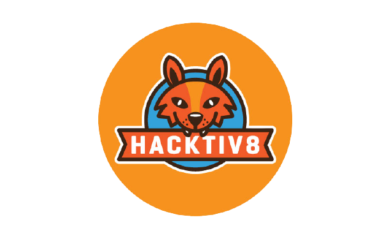

<div id="top"></div>
<!--
*** Thanks for checking out the Best-README-Template. If you have a suggestion
*** that would make this better, please fork the repo and create a pull request
*** or simply open an issue with the tag "enhancement".
*** Don't forget to give the project a star!
*** Thanks again! Now go create something AMAZING! :D
-->

<!-- PROJECT SHIELDS -->
<!--
*** I'm using markdown "reference style" links for readability.
*** Reference links are enclosed in brackets [ ] instead of parentheses ( ).
*** See the bottom of this document for the declaration of the reference variables
*** for contributors-url, forks-url, etc. This is an optional, concise syntax you may use.
*** https://www.markdownguide.org/basic-syntax/#reference-style-links
-->

<!-- PROJECT LOGO -->
<br />
<div align="center">
  <a href="https://github.com/othneildrew/Best-README-Template">
    
  </a>

  <h3 align="center">Kampus Merdeka - Studi Independen</h3>

  <p align="center">
    Intro to Node JS
    <br />
    <a href="https://github.com/zhafirahajar/FP2_H8"><strong>Explore the docs »</strong></a>
    <br />
    <br />
    <a href="#heroku link">View Demo</a>
  </p>
</div>

<!-- TABLE OF CONTENTS -->
<details>
  <summary>Table of Contents</summary>
  <ol>
    <li>
      <a href="#about-the-project">About The Project</a>
      <ul>
        <li><a href="#built-with">Built With</a></li>
      </ul>
    </li>
    <li>
      <a href="#getting-started">Getting Started</a>
      <ul>
        <li><a href="#prerequisites">Prerequisites</a></li>
        <li><a href="#installation">Installation</a></li>
      </ul>
    </li>
    <li><a href="#contact">Contact</a></li>
  </ol>
</details>

<!-- ABOUT THE PROJECT -->

## About The Project

This project was made to fullfill Kampus Merdeka - Studi Independen - Intro to Node JS Final Projects.

<p align="right">(<a href="#top">back to top</a>)</p>

### Built With

- [Node.js](https://nodejs.org/en/docs/)
- [JSON Web Token (JWT)](https://www.npmjs.com/package/jsonwebtoken)
- [Bcrypt](https://www.npmjs.com/package/bcrypt)
- [Express](https://www.npmjs.com/package/express)
- [Sequelize ](https://www.npmjs.com/package/sequelize)
- [Sequelize-cli](https://www.npmjs.com/package/sequelize-cli)

<p align="right">(<a href="#top">back to top</a>)</p>

<!-- GETTING STARTED -->

## Getting Started

### Installation

1. Clone the repo
   ```sh
   git clone git@github.com:zhafirahajar/FP2_H8.git
   ```
2. Install NPM packages
   ```sh
   npm install
   ```

<p align="right">(<a href="#top">back to top</a>)</p>

<!-- LICENSE -->

## License

Distributed under the MIT License.

<p align="right">(<a href="#top">back to top</a>)</p>

<!-- CONTACT -->

## Contact

Zhafira Hajar - [Linkedin](https://www.linkedin.com/in/zhafira-hajar/) - zfrhjr@gmail.com

Saman - [Linkedin](https://www.linkedin.com/in)

<p align="right">(<a href="#top">back to top</a>)</p>
